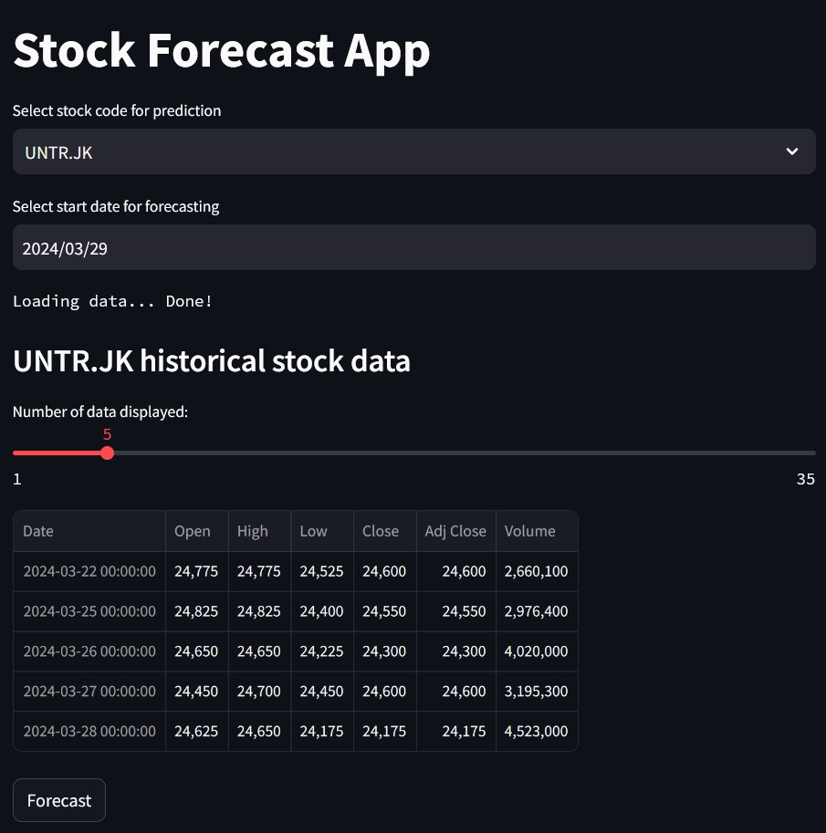
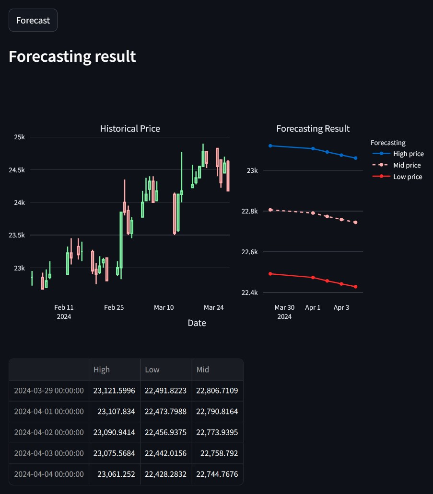

<h1>📊 Building LSTM Neural Networks-Based Sequential Model for UNTR Stock Price Prediction 📈</h1>

<h2>Deskripsi Proyek</h2>

<h3>Memprediksi harga saham UNTR untuk keperluan <i>swing trading</i></h3>

*Swing trading* merupakan salah satu strategi jual-beli di bursa saham, dimana seorang *trader* akan menahan saham yang sudah dibeli selama satu hari atau lebih dalam upaya mendapatkan keuntungan dari perubahan harga. Seorang *swing trader* akan  lebih lama berada pada posisi *swing  trading* dibandingkan posisi *day trading* tetapi akan lebih pendek  dibandingkan strategi *investing*.

Saham UNTR (United Tractor) merupakan saham yang sering digunakan oleh *swing trader* dalam melakukan aktivitas jual-beli. Kondisi fundamental perusahaan yang baik serta likuiditas yang tinggi akan membuat resiko kerugian lebih kecil. Volatilitas harian hingga 4% menjadi peluang yang dapat dimaksimalkan oleh *trader*.

Oleh karena itu, untuk membantu *swing trader* dalam membuat keputusan *trading* maka diperlukan suatu *tools* yang dapat memberikan proyeksi harga tertinggi dan terendah saham UNTR untuk 5 hari ke depan (1 minggu hari aktif bursa).

<h2>Tujuan dan Alur Proyek</h2>

<h3>Tujuan</h3>

Tujuan yang ingin dicapai pada proyek ini adalah dapat menghasilkan model yang mampu memprediksi harga saham untuk komponen harga tertinggi dan harga terendah secara akurat. Penilaian kualitas model akan mengacu pada hasil skor MAPE (*Mean Absolute Percentage Error*) ketika model memprediksi *testing dataset*.

<h3>Alur Proyek</h3>

Adapun proses yang akan dilakukan dalam proses analis untuk proyek ini terdiri dari beberapa langkah utama, yaitu:
1. **Ikhtisar Data.** 
 Pada bagian ini, data yang telah diimpor akan dipahami setiap parameter data serta sejumlah catatan dokumentasi terkait dataset.
        
2. **Mempersiapkan Data.** 
 Pada bagian ini, data yang telah diimpor akan dilakukan proses eksplorasi untuk melihat berbagai permasalahan pada data kemudian dilanjutkan dengan perbaikan data. Apabila diperlukan, reduksi dan pengayaan data akan dilakukan untuk membuang informasi yang tidak relevan dan memperkaya informasi pada dataset. Hasil akhir dari proses ini yaitu dataset yang siap untuk dilakukan proses analisis.
        
3. **Analisa Data Eksploratif.** 
 Pada bagian ini, data yang telah dipersiapkan akan dilakukan sejumlah perhitungan statistik deskriptif dan menampilkan sejumlah visualisasi data untuk melihat pola-pola tertentu.

4. **Membangun Model *Machine-learning*.** 
 Pada tahap ini akan dilakukan sejumlah *feature engineering*, persiapan arsitektur model, pelatihan model dan evaluasi model. 

5. **Membuat Interface Model.** 
 Pada tahap ini model yang telah dilatih akan digunakan untuk melakukan prediksi dengan tampilan yang mudah digunakan oleh pengguna. 

<h2>Model Deployment Menggunakan Streamlit</h2>

Agar mempermudah pengguna dalam menggunakan model yang telah dilatih dan dievaluasi untuk prediksi harga saham, maka kita perlu membuat UI (*user interface*). Adapun platform yang digunakan untuk pembuatan UI tersebut yakni **Streamlit**.

Untuk mengakses model yang telah dibuatkan UI-nya, maka dapat diakses pada link berikut: https://stockpriceforecasting01.streamlit.app/

